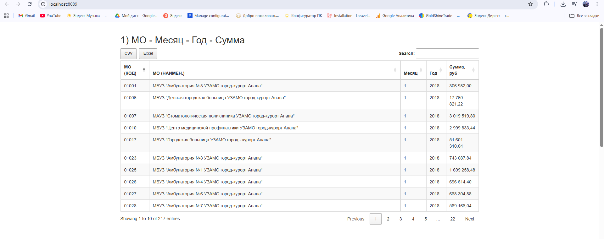
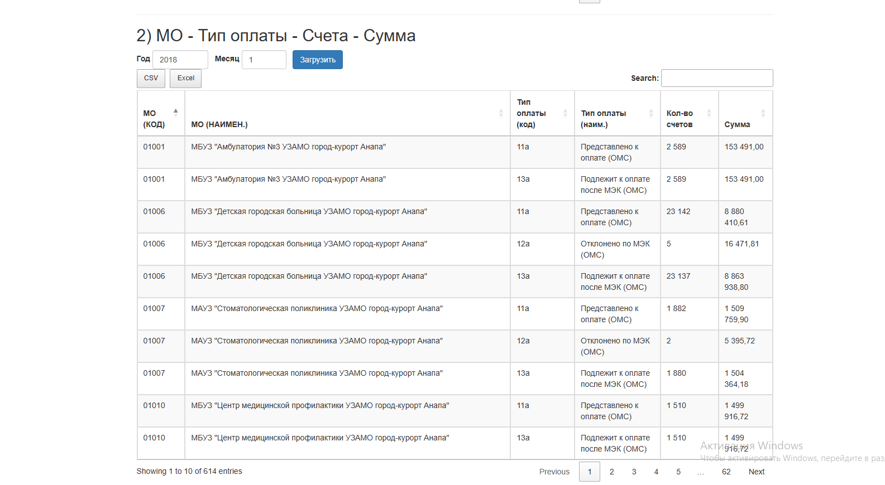

В рамках тестового задания было реализовано **одностраничное веб-приложение** на **PHP (PDO + SQL Server)** с использованием:
- Docker Compose для разворачивания окружения (PHP + MS SQL Server);
- Twitter Bootstrap 3.3 для вёрстки;
- jQuery + DataTables для интерактивных таблиц;
- AJAX для получения данных из API;
- Возможность выгрузки таблиц в **CSV** и **Excel**.

Приложение отображает набор отчётных данных по медучреждениям и позволяет:
- просматривать отчёты в виде таблиц,
- фильтровать по ключевым словам,
- сортировать и переключать страницы,
- экспортировать данные.

---

##  Стек
- **Backend:** PHP 8.x, PDO (sqlsrv), Microsoft SQL Server
- **Frontend:** jQuery, Bootstrap 3.3, DataTables
- **Инфраструктура:** Docker + docker-compose

---

##  Запуск проекта
1. Клонировать репозиторий:
   git clone git@github.com:tigr322/TestKTFORMS.git
   cd TestKTFORMS

Отчёты KTFOMS (SQL Server → PHP → DataTables)

Полный набор: хранимые процедуры, API (report.php) и веб-страница (index.html) с экспортом в CSV/Excel.
Бэкенд: SQL Server + PHP 8 (pdo_sqlsrv).
Фронт: jQuery DataTables.

Содержание

Требования

Структура проекта

Подготовка БД

Загрузка процедур в БД

API: public/api/report.php

UI: public/index.html

Быстрая проверка

Типичные проблемы и решения

Безопасность и конфигурация

Дальнейшие улучшения

Требования

SQL Server (локально/в Docker).

PHP 8.x с установленным расширением pdo_sqlsrv.

Веб-сервер (Nginx/Apache или встроенный PHP сервер).

Доступ к таблицам:

finConsolidatedMaster, finConsolidatedDetail

rfcLPU, rfcTypePayment, rfcHelpForm, rfcSMO, rfcVolume

Рекомендуемые индексы (ускоряют отчёты):

-- fact
CREATE INDEX IX_fcm_year_month ON finConsolidatedMaster(YearCode, MonthCode);
CREATE INDEX IX_fcm_lpu ON finConsolidatedMaster(LPUUrRef);
CREATE INDEX IX_fcm_tp  ON finConsolidatedMaster(TypePaymentRef);
CREATE INDEX IX_fcm_hf  ON finConsolidatedMaster(HelpFormRef);
CREATE INDEX IX_fcm_smo ON finConsolidatedMaster(SMOUrRef);

-- detail
CREATE INDEX IX_fcd_master ON finConsolidatedDetail(finConsolidatedMasterRef);
CREATE INDEX IX_fcd_volume ON finConsolidatedDetail(VolumeRef);

Структура проекта
project-root/
  public/
    index.html
    api/
      report.php
  db/
    backup/
      procedures.sql

Если используешь Docker с Nginx+PHP-FPM — смонтируй public/ как web-root.

Подготовка БД

Мы будем использовать 4 хранимые процедуры:

sp_report_lpu_month_sum — суммы по МО×месяц×год

sp_report_lpu_tpayment @pYear, @pMonth — МО×тип оплаты

sp_report_helpform_volumes @pYear, @pMonth — вид помощи: посещения/обращения/счета/сумма

sp_report_lpu_smo_summary @pYear, @pMonth, @pSmoCode? — МО×СМО (с опциональным фильтром по коду СМО)

Скрипт процедур — в файле db/backup/procedures.sql. Сохрани его в UTF-8 (лучше с BOM), оставь GO между процедурами.

-- 1) МО×месяц×год
IF OBJECT_ID('dbo.sp_report_lpu_month_sum','P') IS NOT NULL
    DROP PROCEDURE dbo.sp_report_lpu_month_sum;
GO
CREATE PROCEDURE dbo.sp_report_lpu_month_sum
AS
BEGIN
  SET NOCOUNT ON;
  SELECT
    lpu.Code      AS [МЕД. ОРГАНИЗАЦИЯ (КОД)],
    lpu.NameShort AS [МЕД. ОРГАНИЗАЦИЯ (НАИМЕНОВАНИЕ)],
    m.MonthCode   AS [МЕСЯЦ],
    m.YearCode    AS [ГОД],
    SUM(m.Summ)   AS [СУММА, РУБ]
  FROM finConsolidatedMaster m
  LEFT JOIN rfcLPU lpu ON lpu.ID = m.LPUUrRef
  GROUP BY lpu.Code, lpu.NameShort, m.MonthCode, m.YearCode
  ORDER BY m.YearCode, m.MonthCode, lpu.Code;
END
GO

-- 2) МО×тип оплаты за период
IF OBJECT_ID('dbo.sp_report_lpu_tpayment','P') IS NOT NULL
    DROP PROCEDURE dbo.sp_report_lpu_tpayment;
GO
CREATE PROCEDURE dbo.sp_report_lpu_tpayment
  @pYear INT, @pMonth INT
AS
BEGIN
  SET NOCOUNT ON;
  SELECT
    lpu.Code        AS [МЕД. ОРГАНИЗАЦИЯ (КОД)],
    lpu.NameShort   AS [МЕД. ОРГАНИЗАЦИЯ (НАИМЕНОВАНИЕ)],
    tp.Code         AS [ТИП ОПЛАТЫ (КОД)],
    tp.NameShort    AS [ТИП ОПЛАТЫ (НАИМЕНОВАНИЕ)],
    SUM(m.CountSch) AS [КОЛИЧЕСТВО СЧЕТОВ],
    SUM(m.Summ)     AS [СУММА]
  FROM finConsolidatedMaster m
  LEFT JOIN rfcLPU lpu ON lpu.ID = m.LPUUrRef
  LEFT JOIN rfcTypePayment tp ON tp.ID = m.TypePaymentRef
  WHERE m.YearCode = @pYear AND m.MonthCode = @pMonth
  GROUP BY lpu.Code, lpu.NameShort, tp.Code, tp.NameShort
  ORDER BY lpu.Code, tp.Code;
END
GO

-- 3) Вид помощи: посещения/обращения/счета/сумма
IF OBJECT_ID('dbo.sp_report_helpform_volumes','P') IS NOT NULL
    DROP PROCEDURE dbo.sp_report_helpform_volumes;
GO
CREATE PROCEDURE dbo.sp_report_helpform_volumes
  @pYear INT, @pMonth INT
AS
BEGIN
  SET NOCOUNT ON;

  DECLARE @visitIds  TABLE(VolumeID INT PRIMARY KEY);
  DECLARE @appealIds TABLE(VolumeID INT PRIMARY KEY);

  INSERT INTO @visitIds(VolumeID)
  SELECT v.ID FROM rfcVolume v
  WHERE v.Name COLLATE Cyrillic_General_CI_AS LIKE N'посещ%';

  INSERT INTO @appealIds(VolumeID)
  SELECT v.ID FROM rfcVolume v
  WHERE v.Name COLLATE Cyrillic_General_CI_AS LIKE N'обращ%';

  SELECT
    hf.Code AS [ВИД ПОМОЩИ (КОД)],
    hf.Name AS [ВИД ПОМОЩИ (НАИМЕНОВАНИЕ)],
    SUM(CASE WHEN vi.VolumeID IS NOT NULL THEN ISNULL(d.CountVol,0) ELSE 0 END) AS [КОЛИЧЕСТВО ПОСЕЩЕНИЙ],
    SUM(CASE WHEN ai.VolumeID IS NOT NULL THEN ISNULL(d.CountVol,0) ELSE 0 END) AS [КОЛИЧЕСТВО ОБРАЩЕНИЙ],
    SUM(ISNULL(m.CountSch,0)) AS [КОЛИЧЕСТВО СЧЕТОВ],
    SUM(ISNULL(m.Summ,0))     AS [СУММА]
  FROM finConsolidatedMaster m
  INNER JOIN rfcHelpForm hf ON hf.ID = m.HelpFormRef
  LEFT JOIN finConsolidatedDetail d ON d.finConsolidatedMasterRef = m.ID
  LEFT JOIN @visitIds  vi ON vi.VolumeID = d.VolumeRef
  LEFT JOIN @appealIds ai ON ai.VolumeID = d.VolumeRef
  WHERE m.YearCode = @pYear AND m.MonthCode = @pMonth
  GROUP BY hf.Code, hf.Name
  ORDER BY hf.Code;
END
GO

-- 4) МО×СМО (опц. фильтр по коду СМО)
IF OBJECT_ID('dbo.sp_report_lpu_smo_summary','P') IS NOT NULL
    DROP PROCEDURE dbo.sp_report_lpu_smo_summary;
GO
CREATE PROCEDURE dbo.sp_report_lpu_smo_summary
    @pYear    INT,
    @pMonth   INT,
    @pSmoCode NVARCHAR(20) = NULL
AS
BEGIN
  SET NOCOUNT ON;

  SELECT
      [МЕД. ОРГАНИЗАЦИЯ (КОД)]          = lpu.Code,
      [МЕД. ОРГАНИЗАЦИЯ (НАИМЕНОВАНИЕ)] = lpu.NameShort,
      [СМО (КОД)]                       = smo.Code,
      [СМО (НАИМЕНОВАНИЕ)]              = smo.Name,
      [КОЛИЧЕСТВО СЧЕТОВ]               = SUM(COALESCE(TRY_CONVERT(INT, m.CountSch), 0)),
      [СУММА]                            = SUM(COALESCE(TRY_CONVERT(DECIMAL(18,2), m.Summ), 0))
  FROM finConsolidatedMaster AS m
  INNER JOIN rfcLPU AS lpu ON lpu.ID = m.LPUUrRef
  INNER JOIN rfcSMO AS smo ON smo.ID = m.SMOUrRef
  WHERE m.YearCode  = @pYear
    AND m.MonthCode = @pMonth
    AND (@pSmoCode IS NULL OR smo.Code = @pSmoCode)
  GROUP BY lpu.Code, lpu.NameShort, smo.Code, smo.Name
  ORDER BY lpu.Code, smo.Code;
END
GO

Загрузка процедур в БД

Важно: при прокидывании файла из PowerShell не потерять кодировку.

Надёжный путь (Docker):

# 1) Копируем файл в контейнер
docker cp .\db\backup\procedures.sql mssql:/tmp/procedures.sql

# 2) Выполняем с указанием UTF-8 (65001) и базы KTFOMS_TEST
docker exec -it mssql /opt/mssql-tools18/bin/sqlcmd `
  -S localhost -U sa -P 'Strong!Passw0rd' -d KTFOMS_TEST -C `
  -f 65001 -i /tmp/procedures.sql

# 3) Проверяем, что все 4 процедуры существуют
docker exec -it mssql /opt/mssql-tools18/bin/sqlcmd `
  -S localhost -U sa -P 'Strong!Passw0rd' -d KTFOMS_TEST -W -h-1 `
  -Q "SELECT name FROM sys.procedures WHERE name LIKE 'sp_report_%';"

API: public/api/report.php
<?php
header('Content-Type: application/json; charset=utf-8');

$server = getenv('MSSQL_HOST') ?: 'mssql';
$port   = getenv('MSSQL_PORT') ?: '1433';
$db     = getenv('MSSQL_DB')   ?: 'KTFOMS_TEST';
$user   = getenv('MSSQL_USER') ?: 'sa';
$pass   = getenv('MSSQL_PASS') ?: 'Strong!Passw0rd';

$dsn = "sqlsrv:Server=$server,$port;Database=$db;Encrypt=yes;TrustServerCertificate=yes";

function bad($msg, $code=400) {
  http_response_code($code);
  echo json_encode(['error' => $msg], JSON_UNESCAPED_UNICODE);
  exit;
}
function inRangeInt($v, $min, $max){ return is_int($v) && $v >= $min && $v <= $max; }

try {
  $pdo = new PDO($dsn, $user, $pass, [
    PDO::ATTR_ERRMODE => PDO::ERRMODE_EXCEPTION,
    "CharacterSet"    => "UTF-8",
  ]);
} catch (PDOException $e) {
  bad('DB connect error', 500);
}

$type = $_GET['type'] ?? '';

try {
  if ($type === 'lpu_month_sum') {
    $stmt = $pdo->query("EXEC sp_report_lpu_month_sum");
    echo json_encode(['data' => $stmt->fetchAll(PDO::FETCH_ASSOC)], JSON_UNESCAPED_UNICODE);

  } elseif ($type === 'lpu_tpayment') {
    $year  = (int)($_GET['year'] ?? 0);
    $month = (int)($_GET['month'] ?? 0);
    if (!inRangeInt($year, 2000, 2100) || !inRangeInt($month, 1, 12)) bad('Bad year/month');

    $stmt = $pdo->prepare("EXEC sp_report_lpu_tpayment @pYear = ?, @pMonth = ?");
    $stmt->execute([$year, $month]);
    echo json_encode(['data' => $stmt->fetchAll(PDO::FETCH_ASSOC)], JSON_UNESCAPED_UNICODE);

  } elseif ($type === 'helpform_volumes') {
    $year  = (int)($_GET['year'] ?? 0);
    $month = (int)($_GET['month'] ?? 0);
    if (!inRangeInt($year, 2000, 2100) || !inRangeInt($month, 1, 12)) bad('Bad year/month');

    $stmt = $pdo->prepare("EXEC sp_report_helpform_volumes @pYear = ?, @pMonth = ?");
    $stmt->execute([$year, $month]);
    echo json_encode(['data' => $stmt->fetchAll(PDO::FETCH_ASSOC)], JSON_UNESCAPED_UNICODE);

  } elseif ($type === 'lpu_smo_summary') {
    $year  = (int)($_GET['year'] ?? 0);
    $month = (int)($_GET['month'] ?? 0);
    $smo   = trim($_GET['smo_code'] ?? '');
    if (!inRangeInt($year, 2000, 2100) || !inRangeInt($month, 1, 12)) bad('Bad year/month');

    if ($smo === '') {
      $stmt = $pdo->prepare("EXEC sp_report_lpu_smo_summary @pYear = ?, @pMonth = ?, @pSmoCode = NULL");
      $stmt->execute([$year, $month]);
    } else {
      $stmt = $pdo->prepare("EXEC sp_report_lpu_smo_summary @pYear = ?, @pMonth = ?, @pSmoCode = ?");
      $stmt->execute([$year, $month, $smo]);
    }
    echo json_encode(['data' => $stmt->fetchAll(PDO::FETCH_ASSOC)], JSON_UNESCAPED_UNICODE);

  } else {
    bad('Unknown report type. Use: lpu_month_sum | lpu_tpayment | helpform_volumes | lpu_smo_summary');
  }
} catch (PDOException $e) {
  bad('Query error', 500);
}

UI: public/index.html

Мини-страница с четырьмя таблицами (DataTables + экспорт):

<!doctype html>
<html lang="ru">
<head>
  <meta charset="utf-8">
  <title>Отчёты KTFOMS</title>
  <meta name="viewport" content="width=device-width, initial-scale=1">
  <link rel="stylesheet"
        href="https://maxcdn.bootstrapcdn.com/bootstrap/3.3.7/css/bootstrap.min.css">
  <link rel="stylesheet"
        href="https://cdn.datatables.net/1.13.8/css/jquery.dataTables.min.css">
  <link rel="stylesheet"
        href="https://cdn.datatables.net/buttons/2.4.2/css/buttons.dataTables.min.css">
  
</head>
<body class="container">
  <h2>1) МО — Месяц — Год — Сумма</h2>
  <table id="tbl1" class="table table-striped table-bordered" width="100%"></table>

  

  <h2>2) МО — Тип оплаты — Счета — Сумма</h2>
  

    
<label>Год</label><input id="y2" class="form-control" style="width:100px" value="2018">

    
<label>Месяц</label><input id="m2" class="form-control" style="width:80px" value="1">

    <button id="load2" class="btn btn-primary">Загрузить</button>
  

  <table id="tbl2" class="table table-striped table-bordered" width="100%"></table>

  

  <h2>3) Вид помощи — Посещения/Обращения/Счета/Сумма</h2>
  

    
<label>Год</label><input id="y3" class="form-control" style="width:100px" value="2018">

    
<label>Месяц</label><input id="m3" class="form-control" style="width:80px" value="1">

    <button id="load3" class="btn btn-primary">Загрузить</button>
  

  <table id="tbl3" class="table table-striped table-bordered" width="100%"></table>

  

  <h2>4) МО × СМО — Счета и Сумма</h2>
  

    
<label>Год</label><input id="y4" class="form-control" style="width:100px" value="2018">

    
<label>Месяц</label><input id="m4" class="form-control" style="width:80px" value="1">

    
<label>СМО (код, опц.)</label><input id="smo4" class="form-control" style="width:140px" placeholder="например 23001">

    <button id="load4" class="btn btn-primary">Загрузить</button>
  

  <table id="tbl4" class="table table-striped table-bordered" width="100%"></table>

  
  
  
  
  
  
</body>
</html>

Быстрая проверка

Запусти PHP-сервер из корня проекта:

php -S 0.0.0.0:8080 -t public

Проверь API:

curl "http://localhost:8080/api/report.php?type=lpu_month_sum"
curl "http://localhost:8080/api/report.php?type=lpu_tpayment&year=2018&month=1"
curl "http://localhost:8080/api/report.php?type=helpform_volumes&year=2018&month=1"
curl "http://localhost:8080/api/report.php?type=lpu_smo_summary&year=2018&month=1&smo_code=23001"

Открой http://localhost:8080/ в браузере.

Типичные проблемы и решения

Кириллица превратилась в ????
Убедись, что:

procedures.sql сохранён в UTF-8;

при загрузке используешь sqlcmd -f 65001;

в PHP-подключении указан "CharacterSet" => "UTF-8";

заголовок ответа: charset=utf-8;

JSON — с JSON_UNESCAPED_UNICODE.

500 в отчёте 3 (helpform_volumes)
Чаще всего процедура отсутствует (по ошибке удалили второй раз). Перегрузи procedures.sql и проверь sys.procedures.

«Could not find stored procedure …»
Проверь наличие процедур:

SELECT name FROM sys.procedures WHERE name LIKE 'sp_report_%';

Медленно
Добавь индексы (см. выше). Для lpu_month_sum при необходимости введи параметры @pYear/@pMonth и фильтр по периоду.

Безопасность и конфигурация

Перенеси доступы к БД в переменные окружения/.env.

В проде не возвращай текст исключений в JSON.

Ограничь доступ к /api/report.php (IP-фильтр, токен, Basic-Auth и т.д., по требованиям).

Включи HTTPS и строгие заголовки (CSP/HSTS) на уровне веб-сервера.

Дальнейшие улучшения

OpenAPI/Swagger для документирования API.

Кэш (Redis/файл) для тяжёлых периодов.

Сервер-сайд обработка DataTables (если объёмы очень большие).

Локализация и маппинг заголовков RU↔EN (если потребуется англоязычный фронт).

Инкрементальные отчёты и фоновые задачи (по расписанию) для предрасчётов.